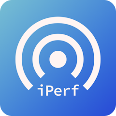

#  Synology iperf3 Speedtest

<!---  --->

### Description

Synology package to run iperf3 to test the network speed between devices and internet speed.
  - Test the speed between 2 local Synology NAS that both have this package installed.
  - Test internet speed from public internet iperf3 servers.

Available for DSM 7 and DSM 6.

**Note:** DSM 6 package only supports 86_64, armv8, armv7 and i686 (**not** x86, armv5, ppc or PowerPC)
  - For 13 series and older models [check your Synology model's CPU Arch here](https://kb.synology.com/en-global/DSM/tutorial/What_kind_of_CPU_does_my_NAS_have)

### How to install the package

There are 2 ways to install the package:

**Directly from Package Center**

1. Add [007revad Synology Package Source](https://github.com/007revad/Synology_package_source) to package Center.
2. Click on the Community section in Package Center and install the package.

<kbd></kbd>

**Or download the package and install it manually**
1. Download the latest version .spk file from https://github.com/007revad/Synology_iperf3_Speedtest/releases and save it to your Synology.
2. In Package Center click on Manual Install.
3. Browse to where you downloaded the .spk file.
4. Select the .spk file and click Next.

### Screenshots

<!--- 
Description of image 1 goes here
 --->

<kbd></kbd>

 

Select another local Synology or internet iperf3 server

<kbd></kbd>

 

Testing Synology to Synology speed

<kbd></kbd>

 

Testing internet speed

<kbd></kbd>

 

Copy the results

<kbd></kbd>

 

Settings

<kbd></kbd>

